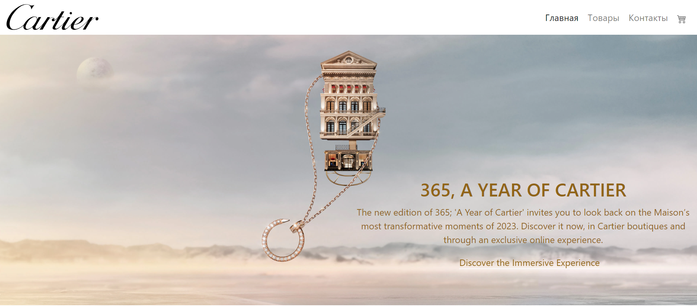

# Проект "Cartier"

___

___

## Функциональность сайта

Интернет-магазин удобен и лёгок в использовании.
+ На сайте представлен каталог товаров
  
+ Возможность управлять товарами в корзине
  
  
+ Возможность оставлять отзывы к товарам
  
+ Адаптирован под все устройства
  
  

___

## Использованные технологии
     

## Ссылка на лендинг

https://willowy-dasik-1783f6.netlify.app/

___

## Разработчики лендинга

     